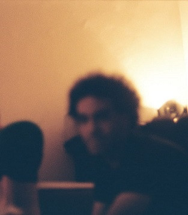

# Presentación

## Estudiante: _Darío N. Gómez  _

Mi nombre es Darío, soy de Avellaneda y tengo 27 años. Estoy cursando las primeras materias de la Tecnicatura en programación. Me gustan/interesan muchas cosas, de las que tengo mayor o menor conocimiento: programación, música, plantas, cocinar, fotografía, cine, pensar, no sé, todo puede ser interesante de aprender y conocer. En este momento me interesa aprender a programar a través de la facultad y en paralelo de manera más autodidacta para poder trabajar lo antes posible.

